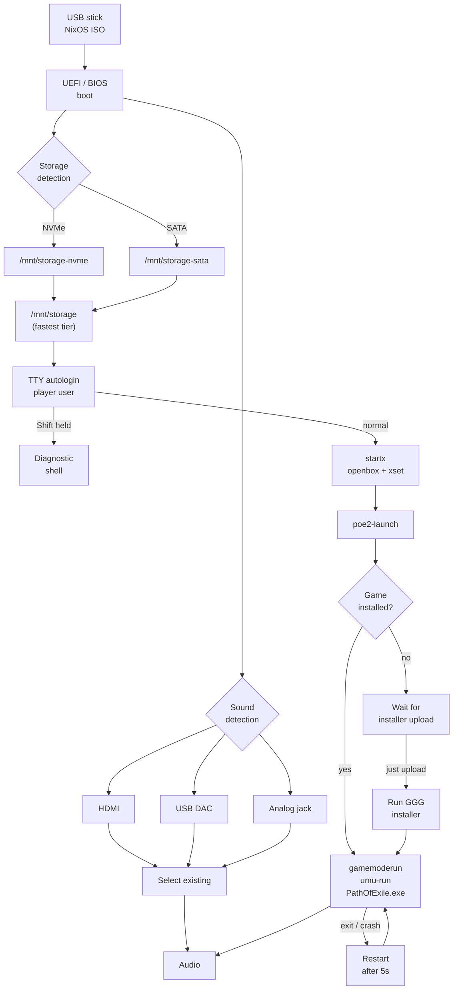

# nixos-poe2

A bootable USB stick that turns a Ryzen / RTX-class host into a Path of
Exile 2 console. No desktop environment, no display manager, no Steam: TTY
autologin → minimal X session → installer (first time) or game (every time
after).

Game data lives on the host's largest internal Linux partition (ext4 by default). The stick
itself stays stateless and is interchangeable across hosts.

## Why?

Some time ago, when I discovered LLM-powered code generation, my gaming PC
got assimilated into the AI collective. All NTFS partitions wiped out,
replaced with ext4 full of Nix builds and models.

With Path of Exile 2 patch 0.5.0 incoming -- bringing all the content for
polishing before the full December release -- there was a dilemma: reinstall
Windows, or build a live Linux OS with Claude using Nix.

Have fun!

## How?

https://github.com/user-attachments/assets/5a7a0c15-3030-4f78-888d-508f928bb79a

## Architecture

## Requirements

- **Build host**: Linux x86_64 with Nix (flakes enabled), 16+ GB RAM,
  multi-core CPU. macOS works via a [remote builder](docs/development.md#building-the-iso).
- **Target host**: AMD or Intel CPU, NVIDIA or AMD GPU, 32+ GB RAM,
  internal disk with a Linux partition for game data (~200 GB, ext4 by default).
  Base game is ~100 GB; major patches (e.g. 0.5.0) can add ~60 GB on top.
- **USB stick**: 4+ GB (ISO is ~2.8 GB). Kingston DataTraveler Kyson
  128 GB tested.
- **Network**: internet access on first boot for ~100 GB game download.
- **GGG account**: needed to download the standalone installer
  (see [Installing the game](docs/usage.md#installing-the-game)).

## Usage

See [docs/usage.md](docs/usage.md) for boot flow, game installation,
host preparation, storage layout, hardware notes, audio, diagnostics,
recovery, and filesystem choice.

## Development

See [docs/development.md](docs/development.md) for build instructions,
customization, development architecture, performance metrics, and
Proton-GE compatibility.

## What's NOT here

- No Steam client.
- No display manager (no SDDM/GDM/LightDM).
- No desktop environment (no KDE, no GNOME, no XFCE).
- No browser, no file manager, no terminal emulator on the X session.
- No anti-cheat support — PoE 2 doesn't currently use kernel-level
  anti-cheat, so this isn't an issue. If that changes, this design needs
  rework.

## License

MIT. See [LICENSE](LICENSE).

## Contributing

See [CONTRIBUTING.md](CONTRIBUTING.md).

## Trademarks

- [Path of Exile 2](https://pathofexile2.com/) and [Grinding Gear Games](https://www.grindinggear.com/) are trademarks of Grinding Gear Games.
- [NVIDIA](https://www.nvidia.com/) is a trademark of NVIDIA Corporation.
- [AMD](https://www.amd.com/) and Ryzen are trademarks of Advanced Micro Devices, Inc.
- [Steam](https://store.steampowered.com/) is a trademark of [Valve Corporation](https://www.valvesoftware.com/).
- [Wine](https://www.winehq.org/) is a project of the Wine community.
- [Proton-GE](https://github.com/GloriousEggroll/proton-ge-custom) is maintained by GloriousEggroll.
- [MangoHud](https://github.com/flightlessmango/MangoHud), [winetricks](https://github.com/Winetricks/winetricks), [DXVK](https://github.com/doitsujin/dxvk), and [umu-launcher](https://github.com/Open-Wine-Components/umu-launcher) are open-source community projects.
- [NixOS](https://nixos.org/) is a trademark of the NixOS Foundation.
- This project is not affiliated with, endorsed by, or sponsored by any of these entities.
