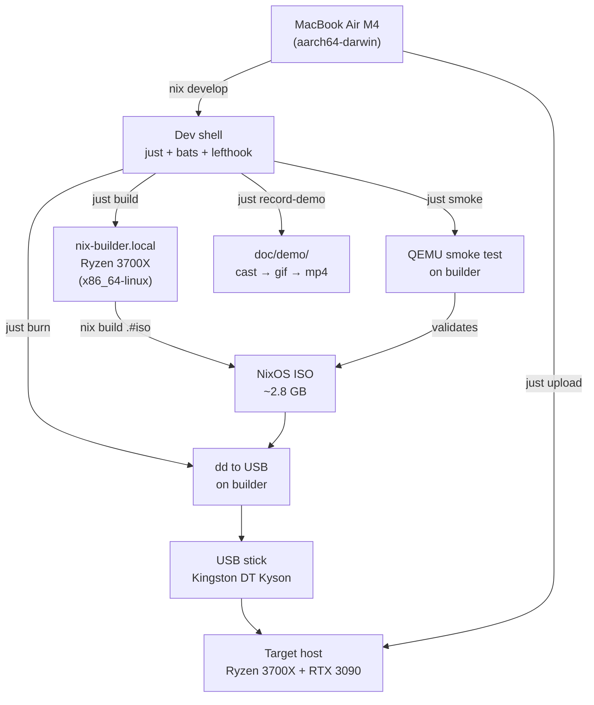

# Development

## Customization

User preferences live in `config/user/` (gitignored). Run `just config`
to set them interactively, or create the files manually:

| File | Purpose | Default |
|------|---------|---------|
| `config/user/locale` | System locale | `en_US.UTF-8` |
| `config/user/timezone` | Timezone | `Europe/Warsaw` |
| `config/user/keymap` | Console keymap | `us` |
| `config/user/fstype` | Storage filesystem | `ext4` |

These are baked into the ISO at build time. Change them and rebuild to
apply.

Authentication is SSH-key-only. Place your public keys in
`secrets/authorized_keys` (one per line). Both `player` and `root`
get the same key set. Local console uses passwordless autologin.

## Integration

See [integration.md](integration.md) for the full hook pipeline
(26 pre-commit + 29 pre-push hooks), CI setup, and how to add new hooks.

## Architecture



## Building the ISO

Requires a **Linux x86_64** machine with Nix (flakes enabled). macOS cannot
build NixOS ISOs natively — use a
[remote builder](https://nix.dev/tutorials/nixos/distributed-builds-setup.html).

The build compiles NVIDIA proprietary drivers and assembles a full ISO
closure, so a fast multi-core builder with ample RAM (16 GB+) and disk
is recommended.

```sh
git clone https://github.com/pr0d1r2/nixos-poe2.git
cd nixos-poe2
# Drop PathOfExile2Installer.exe into pkgs/installer/ now.
nix build .#iso
ls -lh result/iso/
```

From macOS via `nix-builder.local`:

```sh
nix build .#iso --builders 'ssh://nix-builder.local x86_64-linux'
```

Expect ~1.5 GB (vs ~3.5 GB for a full-desktop image).

## Writing it to a USB stick

```sh
# Identify the disk (NOT a partition):
lsblk -d -o NAME,SIZE,TRAN,MODEL

# Write it (REPLACE /dev/sdX with your stick — this wipes the disk):
sudo dd if=result/iso/nixos-*.iso of=/dev/sdX bs=4M status=progress conv=fsync
```

## Performance

Measured on Ryzen 3700X builder (8c/16t, 32 GB RAM, NVMe).

| Metric | Value | Notes |
|--------|-------|-------|
| ISO size | 2.8 GB | Includes NVIDIA drivers + Proton-GE |
| Build (warm cache) | ~4 min | Incremental, only changed derivations |
| Build (cold cache) | ~7 min | After reboot, nix store repopulated |
| Nix cache warmup | ~5 min | ~340 MB / ~230 packages on first build |
| QEMU boot to login | ~18 s | KVM-accelerated, direct kernel boot |
| Smoke test (total) | ~8 min | SSH setup + drive prep + boot + diagnostics |

USB burn speed depends on media (Kingston DT Kyson: ~5 MB/s write).

## Proton-GE compatibility

The Proton-GE version is determined by the `nixos-25.11` nixpkgs pin. If a
nixpkgs update ships a Proton-GE that breaks PoE 2 compatibility, override
it in `flake.nix` via `proton-ge-bin.override` to pin a known-good version.
