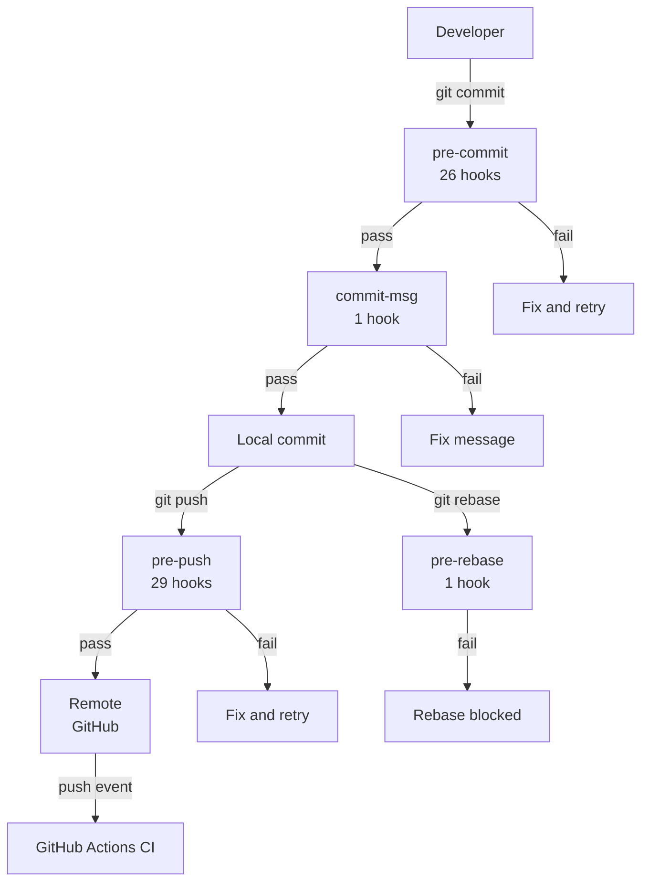
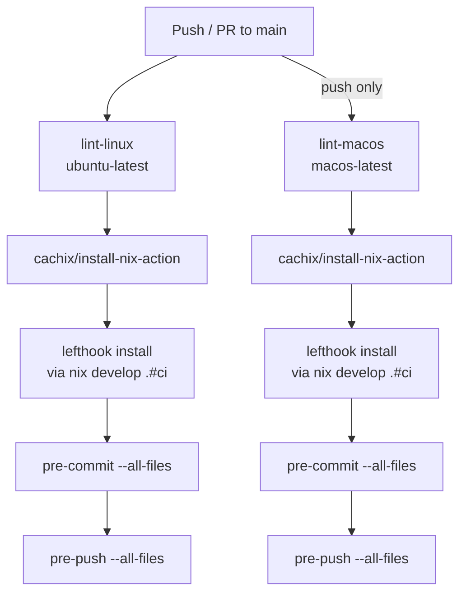

# Integration

Code quality is enforced at two layers: local git hooks catch issues
before they leave the developer's machine, and GitHub Actions CI
re-validates on every push to the remote.

## Pipeline



## Local hooks (lefthook)

All hooks are managed by [lefthook](https://github.com/evilmartians/lefthook)
and installed automatically via `nix develop`. Hook definitions come from
33 remote modules at `github.com/pr0d1r2/nix-lefthook-*` plus 2 local
overrides in `lefthook.yml`.

### pre-commit (26 hooks)

Run on every `git commit`. Fast, file-scoped checks.

| Category | Hooks | Purpose |
|----------|-------|---------|
| **Formatting** | [nixfmt](https://github.com/pr0d1r2/nix-lefthook-nixfmt), [shfmt](https://github.com/pr0d1r2/nix-lefthook-shfmt), [taplo](https://github.com/pr0d1r2/nix-lefthook-taplo) | Auto-format Nix, shell, TOML |
| **Linting** | [shellcheck](https://github.com/pr0d1r2/nix-lefthook-shellcheck), [statix](https://github.com/pr0d1r2/nix-lefthook-statix), [deadnix](https://github.com/pr0d1r2/nix-lefthook-deadnix), [markdownlint](https://github.com/pr0d1r2/nix-lefthook-markdownlint), [yamllint](https://github.com/pr0d1r2/nix-lefthook-yamllint) | Static analysis |
| **Syntax** | [bats-parse](https://github.com/pr0d1r2/nix-lefthook-bats-parse), [tcl-syntax](https://github.com/pr0d1r2/nix-lefthook-tcl-syntax), [gawk-lint](https://github.com/pr0d1r2/nix-lefthook-gawk-lint) | Parse validation |
| **Style** | [editorconfig-checker](https://github.com/pr0d1r2/nix-lefthook-editorconfig-checker), [trailing-whitespace](https://github.com/pr0d1r2/nix-lefthook-trailing-whitespace), [missing-final-newline](https://github.com/pr0d1r2/nix-lefthook-missing-final-newline) | Whitespace consistency |
| **Security** | [gitleaks](https://github.com/pr0d1r2/nix-lefthook-gitleaks), [git-no-local-paths](https://github.com/pr0d1r2/nix-lefthook-git-no-local-paths) | Secret and path leak prevention |
| **Conventions** | [ascii-only](https://github.com/pr0d1r2/nix-lefthook-ascii-only), [unicode-lint](https://github.com/pr0d1r2/nix-lefthook-unicode-lint), [typos](https://github.com/pr0d1r2/nix-lefthook-typos) | Text quality |
| **Architecture** | [no-shell-functions](https://github.com/pr0d1r2/nix-lefthook-no-shell-functions), [nix-no-embedded-shell](https://github.com/pr0d1r2/nix-lefthook-nix-no-embedded-shell), [justfile-no-embedded-shell](https://github.com/pr0d1r2/nix-lefthook-justfile-no-embedded-shell), [justfile-alphabetical](https://github.com/pr0d1r2/nix-lefthook-justfile-alphabetical) | Modularity enforcement |
| **Hygiene** | [execute-permissions](https://github.com/pr0d1r2/nix-lefthook-execute-permissions), [file-size-check](https://github.com/pr0d1r2/nix-lefthook-file-size-check), [git-conflict-markers](https://github.com/pr0d1r2/nix-lefthook-git-conflict-markers) | Repo cleanliness |
| **Testing** | [bats-unit](https://github.com/pr0d1r2/nix-lefthook-bats-unit), [tdd-order-bats](https://github.com/pr0d1r2/nix-lefthook-tdd-order-bats) | Unit tests and TDD discipline |

### commit-msg (1 hook)

| Hook | Purpose |
|------|---------|
| [commit-msg-lint](https://github.com/pr0d1r2/nix-lefthook-commit-msg-lint) | Validates commit message format |

### pre-push (29 hooks)

All pre-commit hooks plus:

| Hook | Purpose |
|------|---------|
| [bats-changed](https://github.com/pr0d1r2/nix-lefthook-bats-changed) | Warns when modified scripts lack corresponding bats tests |
| [linter-coverage](https://github.com/pr0d1r2/nix-lefthook-linter-coverage) | Verifies every file extension has a documented linter |

### pre-rebase (1 hook)

| Hook | Purpose |
|------|---------|
| [pre-rebase-merged-commits](https://github.com/pr0d1r2/nix-lefthook-pre-rebase-merged-commits) | Blocks rebase over already-merged commits |

## GitHub Actions CI

CI mirrors the local hook suite on GitHub-hosted runners. This provides
a trust boundary: local hooks can be bypassed with `--no-verify`, but
CI cannot be skipped on protected branches.



- **Trigger**: push to `main`, pull request, manual dispatch
- **Runners**: `ubuntu-latest` (always), `macos-latest` (push + dispatch)
- **Shell**: `nix develop .#ci` — lean devShell with hooks only, no
  interactive tools (asciinema, ffmpeg, pv)
- **Steps**: install lefthook remotes → pre-commit → pre-push
- **Config**: `.github/workflows/ci.yml`

The ISO build is not part of CI — it requires x86_64-linux with NVIDIA
drivers and runs on the dedicated builder via `just build`.

## Running hooks manually

```sh
lefthook run pre-commit --all-files    # all pre-commit hooks on all files
lefthook run pre-push --all-files      # all pre-push hooks on all files
```

## Adding a new hook

1. Add the remote module URL to `lefthook.yml` under `remotes:`.
2. Add any local overrides under the appropriate phase.
3. Update `docs/linter-coverage.md` if the hook covers a new file extension.
4. Run `lefthook run pre-push --all-files` to verify.
